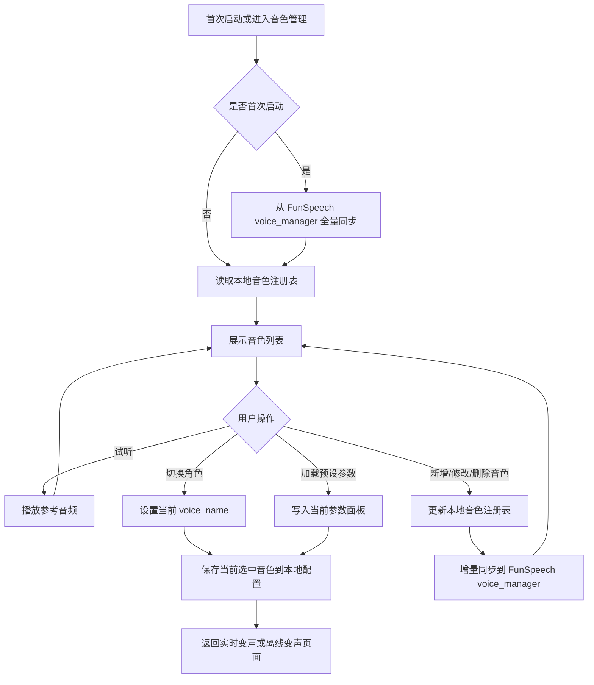
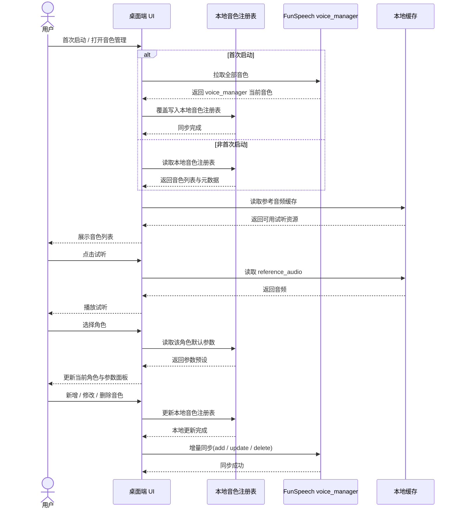
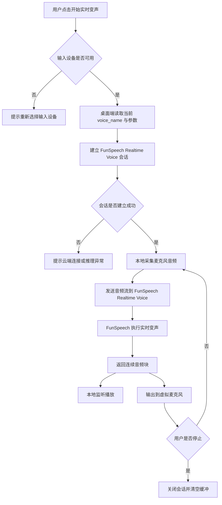
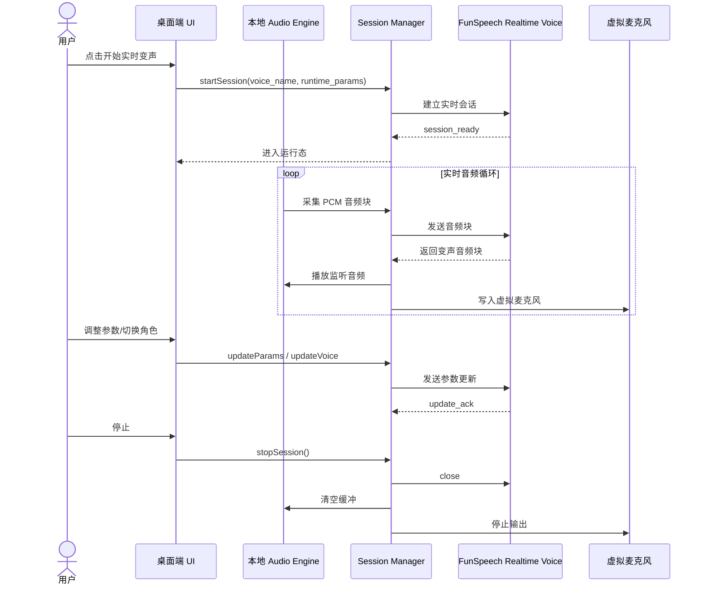
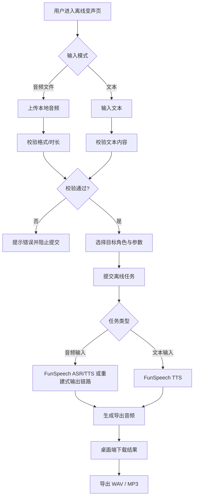
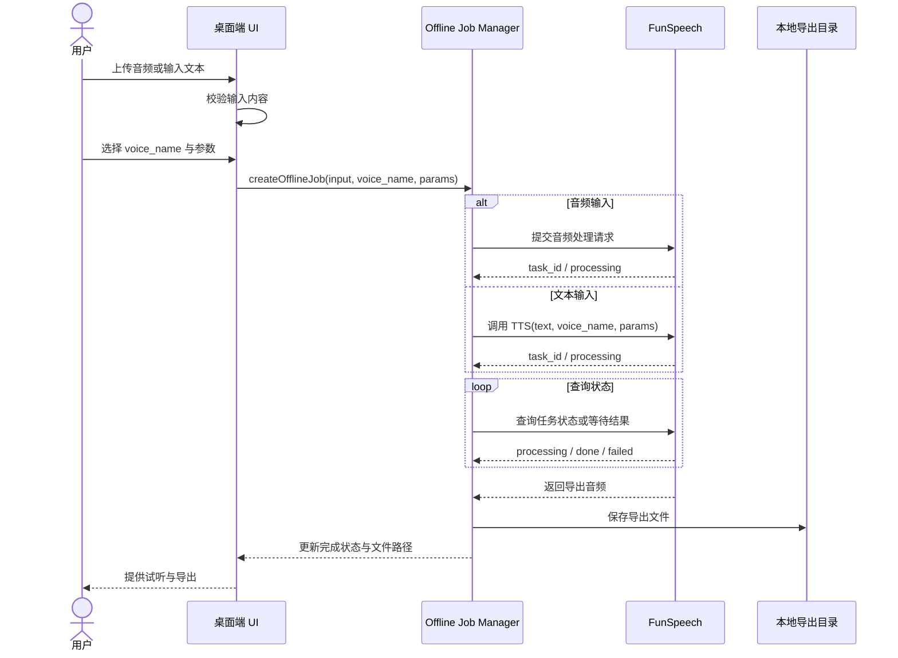
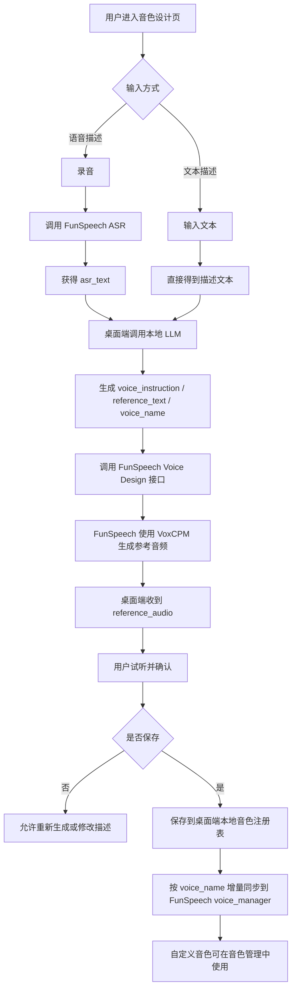
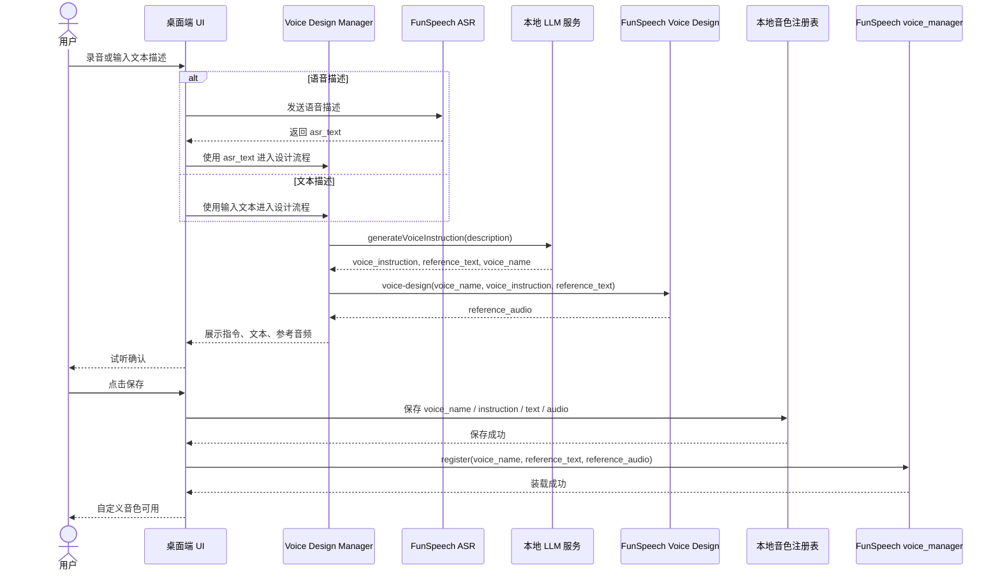

# Voice Cloner 流程图与时序图

本文为 MVP 四个核心模块补充流程图与时序图：

- 音色管理
- 实时变声
- 离线变声
- 音色设计

图示基于当前 PRD 与技术架构约束：

- 桌面端是主交互与本地注册表权威
- `FunSpeech` 负责 ASR / TTS / Realtime Voice / Voice Design / `voice_manager`
- LLM 服务由桌面端直接调用本地模型服务
- 首次启动从 `FunSpeech voice_manager` 全量同步，后续新增 / 修改 / 删除走增量同步

## 1. 音色管理

### 1.1 流程图

### 1.2 时序图

## 2. 实时变声

### 2.1 流程图

### 2.2 时序图

## 3. 离线变声

### 3.1 流程图

### 3.2 时序图

## 4. 音色设计

### 4.1 流程图

### 4.2 时序图

## 5. 使用建议

- 这份文档适合直接放进设计评审或实现拆解里
- 如果后续要继续细化，我建议下一步补：
  - 异常分支时序图
  - 实时变声参数更新时序图
  - 音色设计失败回退图
  - `FunSpeech` 接口契约图
